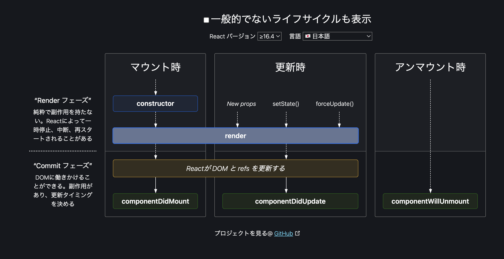

# React Hooks Review
Reactフックスの復習用リポジトリ

## useEffect
副作用を有する可能性のある処理を受け付け、レンダリングが行われたタイミングで実行することができるReactフック。   
以下のようなクラスコンポーネントにあるライフサイクルメソッドを関数コンポーネントで使用できるイメージ。

* componentDidMount
* componentDidUpdate
* componentWillUnmount

以下のように記述すると```componentDidMount```と```componentDidUpdate```、```componentWillUnmount```を全てのタイミングで処理が実行される。

```ts
useEffect(() => {
  console.log('レンダーされました。');
  return () => {
      // clean up処理を記述する。
      console.log('クリーンアップします。');
  };
});
```

useEffectを使用する主なケースとしては以下のようなケースがある。

* レンダリングされたタイミングで処理を実行したい時
* 初回レンダリング時のみ処理を実行したい時（例: APIリクエスト）
* 特定のstateの更新による再レンダリングのタイミングで処理を実行したい時

### コンポーネントのライフサイクル
**Reactコンポーネントがブラウザに表示されて消えるまでの過程のことを表す**   

ライフサイクルの各フェーズに介入して任意の処理を差し込むことができるメソッドのことを**ライフサイクルメソッド**と呼ぶ。



> 引用: https://projects.wojtekmaj.pl/react-lifecycle-methods-diagram/

|  タイミングと内容  |  時間帯に例えると…  |  日の出に例えるなら  |
| ---- | ---- | ---- |
|  Mounting  |  コンポーネントがユーザーにレンダリングされるまでの仕込みの期間  |  日の出  |
|  Updating  |  コンポーネントがユーザに表示されており、ユーザーが操作できる期間  |  日中  |
|  Unmounting  |  他のコンポーネントに切り替え前に現在表示されているコンポーネントを破棄するための期間  |  日没  |

> 参考: https://media.wemotion.co.jp/technology/%E3%80%90react%E3%81%AE%E8%A8%AD%E8%A8%88%E3%82%92%E5%AD%A6%E3%81%B6%E3%80%91%E3%83%A9%E3%82%A4%E3%83%95%E3%82%B5%E3%82%A4%E3%82%AF%E3%83%AB%E3%82%92%E7%9F%A5%E3%82%8D%E3%81%86/

#### Mounting（マウント時）
|  メソッド  |  説明  |
| ---- | ---- |
|  constructor  |  コンストラクタ。（コンポーネントのMount前に一番最初に呼ばれる）  |
|  getDerivedStateFromProps  |  レンダリングの直前に呼ばれ、戻り値でLocal Stateを変更することができる（使用頻度は低い）  |
|  render  |  レンダリングを行う（jsxを評価して、仮想DOMを構築するフェーズ）  |
|  **componetDidMount**  |  コンポーネントがマウントされた直後に呼ばれる  |

useEffectで```componetDidMount```時に処理を行う時は以下のように記述を行う。   
第2引数には空の配列を渡す。

```ts
useEffect(() => {
// 処理を記述する
}, []);
```

#### Updating（更新時）
|  メソッド  |  説明  |
| ---- | ---- |
|  getDerivedStateFromProps  |  レンダリングの直前に呼ばれ、戻り値でLocal Stateを変更することができる（使用頻度は低い）  |
|  shouldComponentUpdate  |  再レンダリングの直前に呼ばれ、falseを返せば再レンダリングを中止できる  |
|  render  |  レンダリングを行う（jsxを評価して、仮想DOMを構築するフェーズ）  |
|  getSnapshotBeforeUpdate  |  コンポーネントが変更される直前に呼ば れ、戻り値でスナップショットを取って おける（使用頻度は低い）  |
|  **componentDidUpdate**  |  コンポーネントが変更された直後に呼ばれる  |

useEffectで```componentDidUpdate```時に処理を行う時は以下のように記述を行う。   

```ts
useEffect(() => {
// 処理を記述する
});
```

第2引数を省略するとコンポーネントがレンダリングされるたびに副作用関数が実行されるため、第2引数を省略することはほぼない。  
以下のような処理を書くと無限ループを引き起こす。

```ts
const [counter, setCounter] = useState(0);

useEffect(() => {
  setCounter(counter + 1)
});
```

**無限ループを引き起こす原因**
1. コンポーネントがレンダリングされた時にstateが変更される
2. stateが変更されたことによってCounter2というコンポーネントが再度レンダリングされる
3. 再レンダリングされたコンポーネントの中でまたstateが変更される（1に戻る）

実際に使用するときはcomponentDidMount時 + componentDidUpdate時に処理を実行することがほとんどである。

```ts
const [counter, setCounter] = useState(0);

useEffect(() => {
// コンポーネントがマウントされた時 + state counterがsetCounterで変更された時に処理を実行する
}, [counter]);
```

コンポーネントが再レンダリングされるのは、基本的には以下の2つの場合のみである。

* そのコンポーネントに渡されているPropsが変更された時
* コンポーネント自身で管理しているローカルステートの値が変更された時

#### Unmounting（マウント解除時）
|  メソッド  |  説明  |
| ---- | ---- |
|  **componentWillUnmount**  |  コンポーネントがアンマウントされる直前に呼ばれる  |


useEffectで```componentWillUnmount```時に処理を行う時は以下のように記述を行う。   

```ts
useEffect(() => {
  return () => {
  // 処理を記述する
  };
}, []);
```

useEffectの戻り値に関数を指定することで処理のクリーンアップを行うことができる。   
クリーンアップが必要になる処理は以下のような処理。

* イベントリスナーの解除
* タイマー処理のキャンセル
* DBアクセス後の接続解放
